# FOSSEE Workshop Booking  —  React Redesign


==========================================


## Tech Stack

» **React 19** + Vite 6  
» **Tailwind CSS**
» **React Router v7** (client-side routing)  
» **Recharts** (statistics bar charts)  
» **Lucide React** (icons)  
» **react-helmet-async** (page titles / SEO)  
» **Django 3.0.7** (existing backend, session auth)

---

## Setup


**Requirements:** Python 3.8+, Node 18+

```bash
# 1. Clone
git clone https://github.com/<your-username>/workshop_booking_ui_react
cd workshop_booking_ui_react

# 2. Backend
cd backend
python3 -m venv venv && source venv/bin/activate
pip install -r requirements.txt
python3 manage.py migrate
python3 manage.py createsuperuser
python3 manage.py runserver 0.0.0.0:8000
# ↑ prompts you:
#   Username: admin
#   Email: admin@example.com
#   Password: yourpassword
#   Password (again): yourpassword

# 3. Frontend (new terminal)
cd frontend
npm install --legacy-peer-deps
npm run dev
```


## Demo Video

<!-- Replace the link below with your actual demo video link -->
[](https://youtu.be/L_tRy7G3YP4)

<a href="https://youtu.be/L_tRy7G3YP4" target="_blank">
  <button>▶ Watch Demo Video</button>
</a>


## Before & After
### Login Page

| Before | After |
|--------|-------|
| 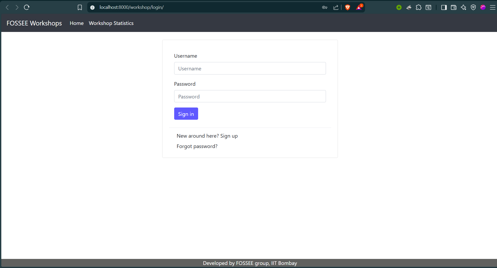 | 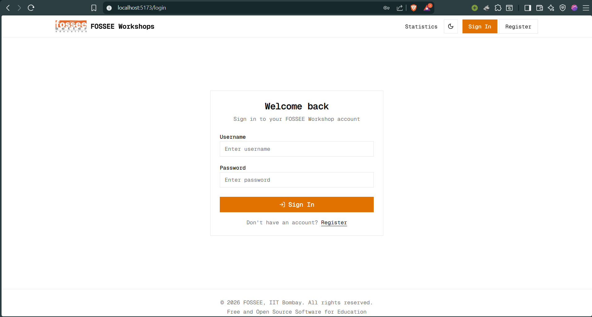 |


---

### Dashboard

| Before | After |
|--------|-------|
| 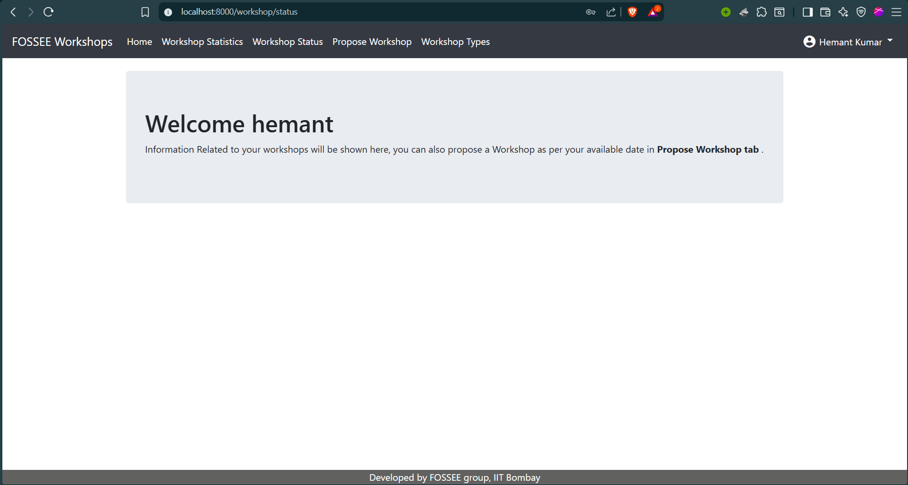 | 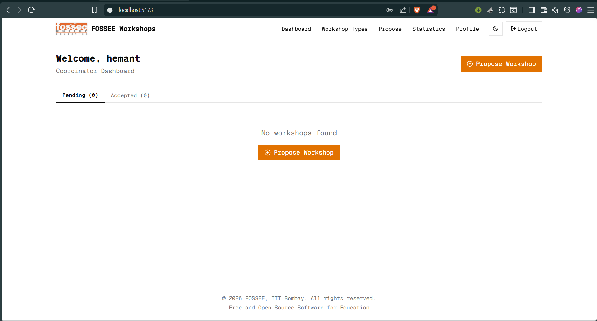 |


---

### Workshop Type (Instructor View)

| Before | After |
|--------|-------|
| 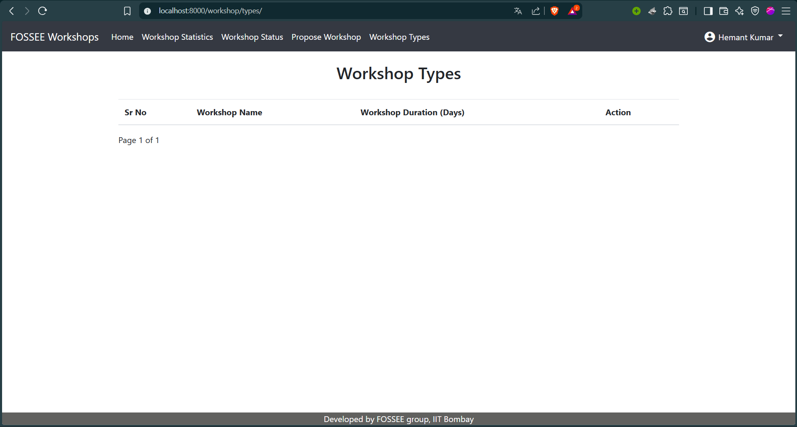 | 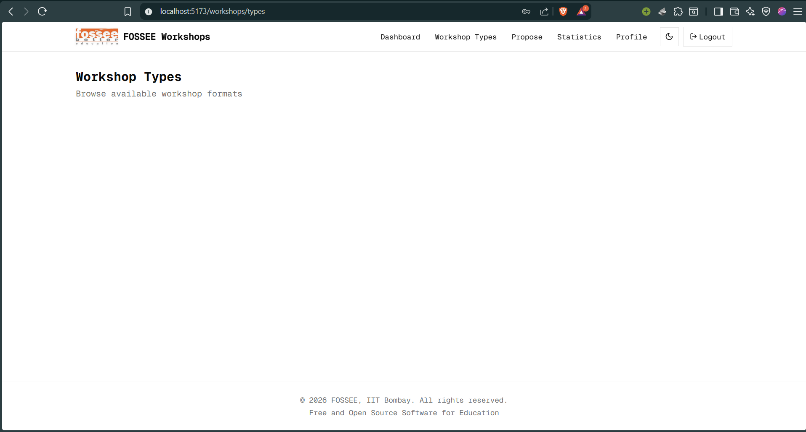 |

*Raw Bootstrap table → Responsive table on desktop, card list on mobile, inline Accept/Date actions*

---

### Profile Page

| Before | After |
|--------|-------|
| 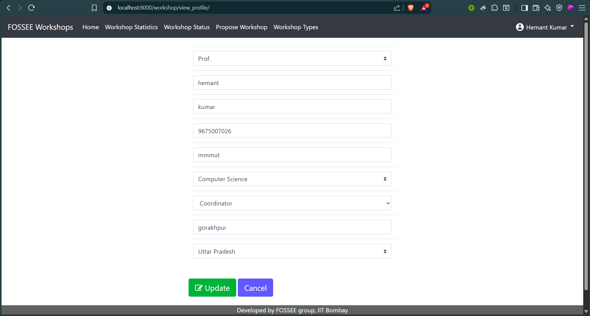 | 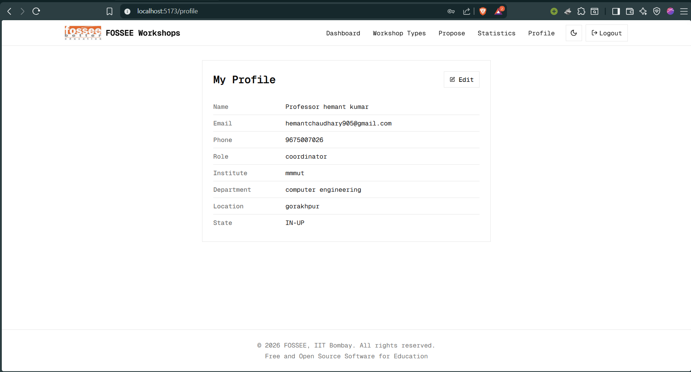 |


---

### Statistics Page

| Before | After |
|--------|-------|
| 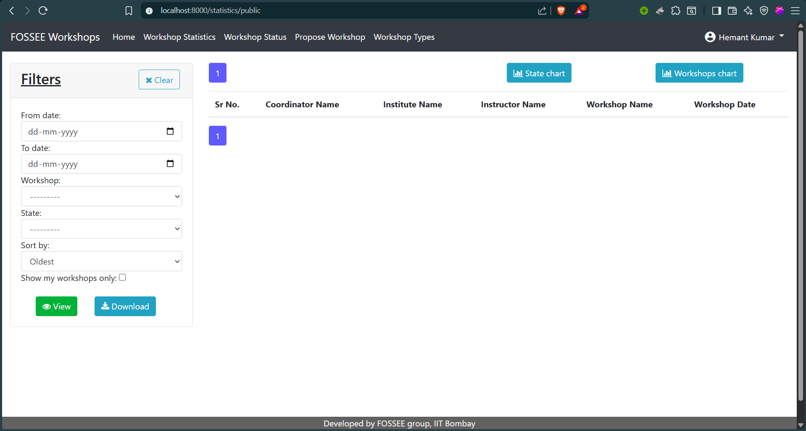 | 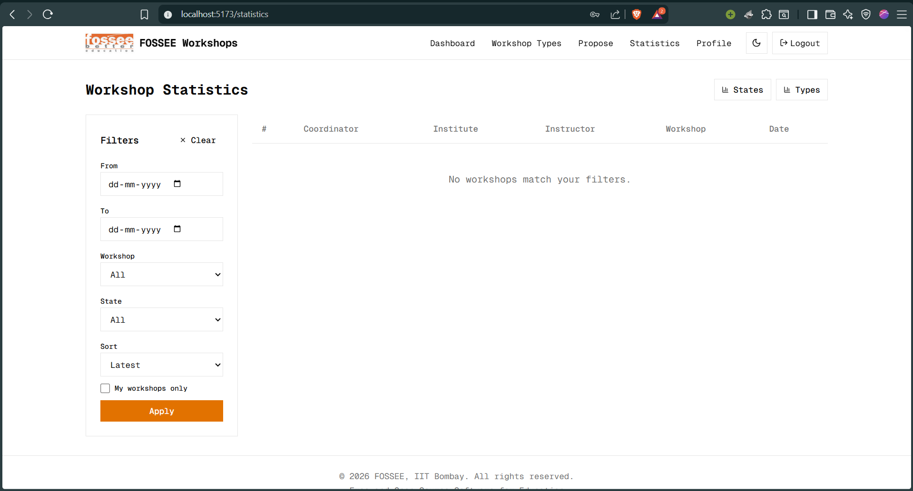 |


---

### Register Page

| Before | After |
|--------|-------|
| 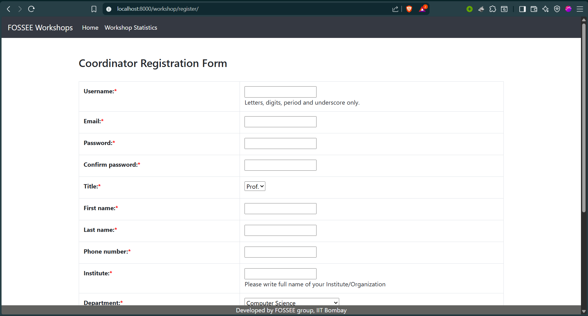 | 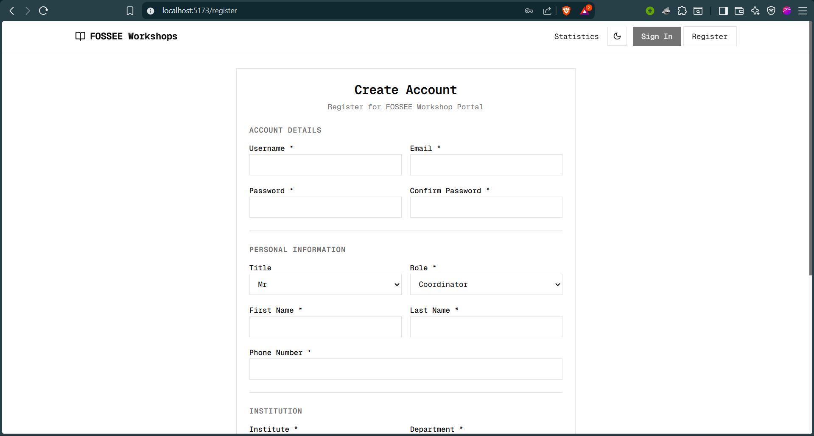 |


## Design Principles

**1. Monochrome First**  
No arbitrary colors. Every surface uses OKLCH-based grayscale tokens
(`--color-base-100` through `--color-base-900`). Makes theming trivial —
dark mode is literally inverting the scale.

**2. Spacing over Decoration**  
Generous whitespace does more than drop shadows. Cards have clean borders,
not glows. Hierarchy comes from font-weight and size, not color.

**3. Composable Components**  
Built 15+ primitives (`Button`, `Card`, `Dialog`, `Table`, `Toast`, `Tabs`…)
in `src/components/ui/`. Each is a thin wrapper with a `cn()` class-merge helper —
same pattern as shadcn/ui but zero external dependency.

**4. Information Density**  
Dashboard shows pending + accepted workshops in tabs. Filters sidebar in Stats
collapses on mobile. Data is always one tap away, never buried.

---

## Responsiveness

» **Mobile-first CSS** — all base styles target small screens, breakpoints add  
  complexity (`sm:`, `md:`, `lg:`) rather than strip it.

» **Dual layouts** — Tables on desktop (`hidden md:block`), Card lists on mobile  
  (`md:hidden`). Dashboard, Stats, and Workshop lists both use this pattern.

» **Hamburger Navbar** — full nav collapses to a slide-in menu on < md screens.

» **Fluid containers** — `container mx-auto px-4` everywhere. No fixed widths.

» **Touch targets** — all interactive elements are at minimum 44×44px per WCAG.

---

## Trade-offs

| Decision | Why | Cost |
|---|---|---|
| No Redux / Zustand | AuthContext + local state is enough for this scope | Would need revisiting at scale |
| Django session auth (not JWT) | Reuses existing backend session infra, no token refresh logic | Requires same-origin or proxy in prod |
| Vite proxy in dev | Zero CORS config needed, dead simple | Needs nginx/caddy proxy rule in production |
| Recharts over Chart.js | Smaller, React-native API, composable | Slightly less config flexibility |

---

## Hardest Part

**Wiring auth across two servers.**

Django 3 session cookies are `HttpOnly` + `SameSite=Lax`. The React app runs on
`:5173`, Django on `:8000`. Getting the CSRF token to flow correctly across the
Vite proxy — and stay alive across page refreshes — took the most iteration.

Approach:
1. Vite proxy forwards `/api/*` → `localhost:8000` (same effective origin to the browser)
2. `GET /api/auth/me/` uses `@ensure_csrf_cookie` so the cookie is always set on first load
3. `api.js` reads `document.cookie` for `csrftoken` and injects it as `X-CSRFToken` header
4. `AuthContext` calls `/api/auth/me/` on mount — if 401, user is guest; if 200, user is logged in

No token storage in `localStorage`. Sessions expire naturally.

---

## Project Structure
------------------

```
workshop-booking/
├── backend/                  ← Django app (untouched except api_views.py)
│   
│
|
└── frontend/                 ← Full React_Code
    └── src/
        ├── components/
        │   ├── ui/           ← Button, Card, Input, Dialog, Table…
        │   ├── Navbar.jsx
        │   ├── Footer.jsx
        │   └── Layout.jsx
        ├── context/
        │   └── AuthContext.jsx
        ├── lib/
        │   ├── api.js        ← fetch wrapper with error handling
        │   └── utils.js
        ├── pages/            ← (Login, Dashboard, Stats, Profile…)
        ├── App.jsx
        └── index.css
```

---

## API Surface

All endpoints live at `/api/` and return JSON.

```
GET  /api/auth/me/             
POST /api/auth/login/
POST /api/auth/logout/
POST /api/auth/register/
POST /api/auth/change-password/

GET  /api/workshops/          
POST /api/workshops/propose/
GET  /api/workshops/:id/
POST /api/workshops/:id/accept/
POST /api/workshops/:id/change-date/
GET  /api/workshops/:id/comments/
POST /api/workshops/:id/comments/

GET  /api/workshop-types/
POST /api/workshop-types/
GET  /api/workshop-types/:id/
PUT  /api/workshop-types/:id/
GET  /api/workshop-types/:id/tnc/

GET  /api/profile/
PUT  /api/profile/
GET  /api/profile/:id/

GET  /api/statistics/public/  
GET  /api/statistics/team/
```

---

Thanks for reading.
